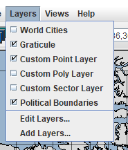
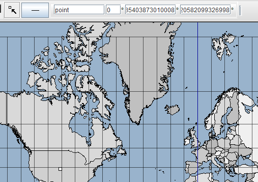
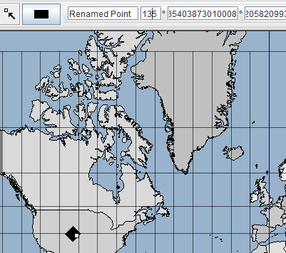
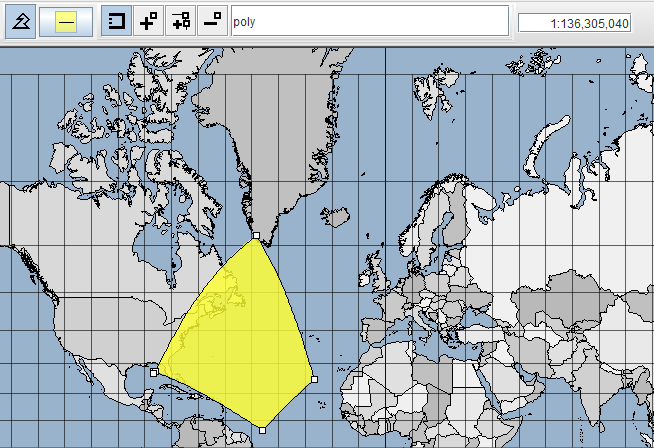
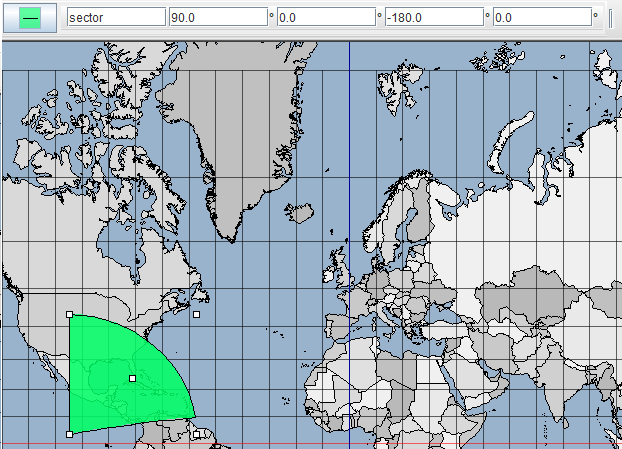
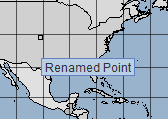
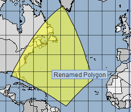
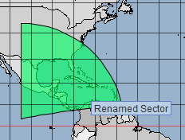

# Swing-приложение с фреймворком OpenMap
## Задание
[Задание](./task.pdf), согласно которому разработано приложение. 
## Запуск приложения
Для запуска приложения необходимо клонировать этот репозиторий и запустить метод **main** в классе [App](./src/main/java/App.java).

В этом же классе можно указать другой конфигурационный файл для запуска приложения.

## Выполнение

### Слои

В приложении реализован функционал для работы с именованными объектами, выделенный в отдельные слои.

Каждый слой отвечает за свой именованный объект и предоставляет инструменты для их редактирования.

**Растры**

Для них так же реализована возможность указывать угол поворота. 

**Полигоны**

**Секторы**

### Подсказки

Для каждого типа объектов реализовано отображение подсказок(tooltips) с их именами.

